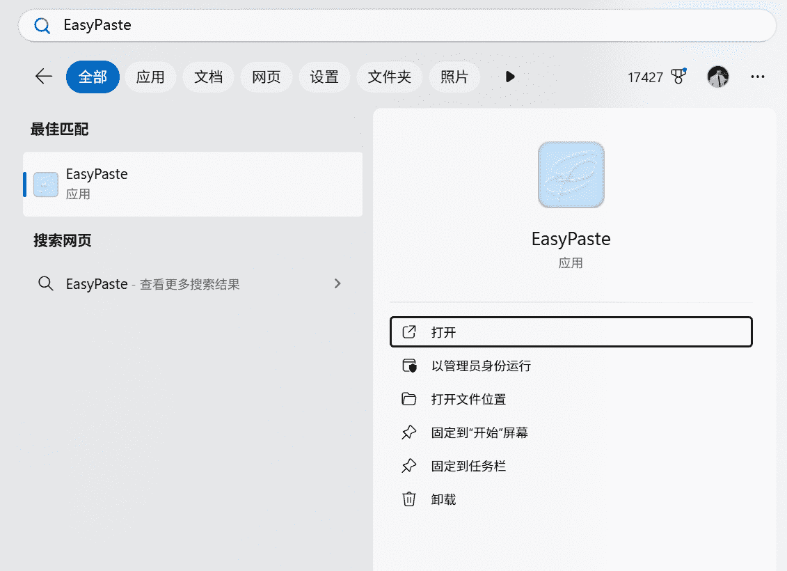
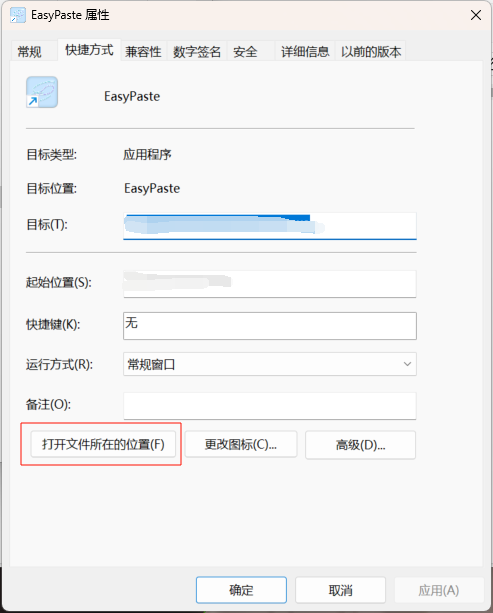
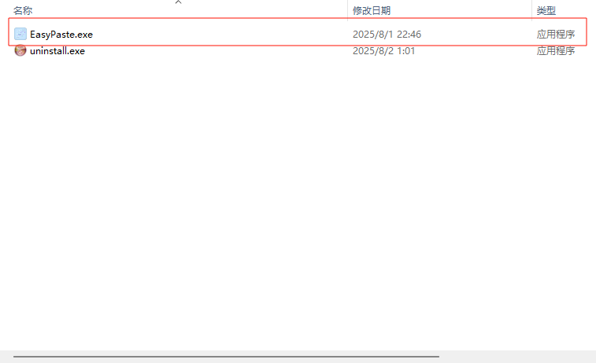
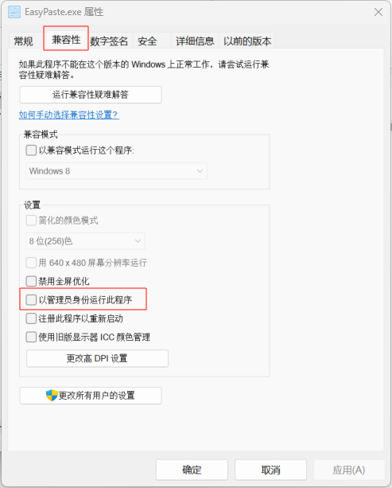

# 如何以管理员权限运行程序
## 临时处理

#### 打开电脑自带的`搜索`功能，输入`EasyPaste`，点击`以管理员身份运行`即可。

## 永久处理
#### 如果知道程序的根目录，可用直接看[第四步](#section1)
#### 1.打开电脑自带的`搜索`功能，输入`EasyPaste`，点击`打开文件位置`。


#### 2.找到`EasyPaste`文件，右键，选择`属性`。


#### 3.由于这个只是一个快捷方式，所以还需要继续找到程序的根目录，继续点击`打开文件所在位置`。



#### 4.找到`EasyPaste`文件，右键，选择`属性`。


#### 5.点击顶部`兼容性`菜单，在所在位置选择`以管理员身份运行此程序`。
