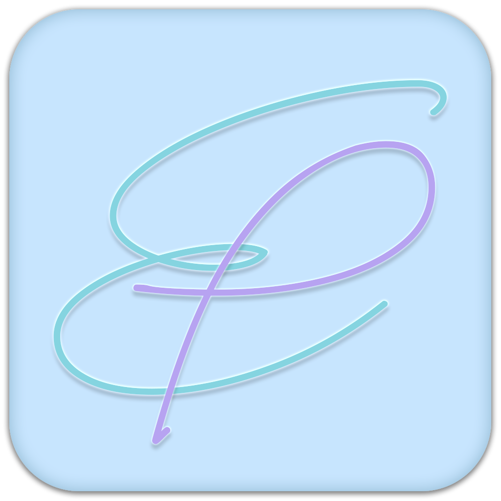

# EasyPaste - Efficient Clipboard Management Tool

<div align="center">
  

  <p>
    <strong>A cross-platform clipboard management tool focused on improving work efficiency</strong>
  </p>

  <p>

[](https://github.com/lin0306/EasyPaste/releases/latest)
[](https://gitee.com/lin0306/EasyPaste/releases/latest)
[](https://www.apache.org/licenses/LICENSE-2.0.html)


  </p>
</div>

[简体中文](README.md) | English

---

> ⚠️ **Project Status**
>
> **Current Version**: v0.3.0 (Test Version)
>
> - ✅ **Testing Environment**: Tested on Windows 10/11 clean systems, core features are stable
> - 🔧 **Quality Assurance**: Adopting strict code standards and security policies, continuously improving
> - 📖 **System Integration**: To fully replace Windows clipboard, open program settings and enable `Replace Global Hotkey` feature
> - 💡 **Feedback Welcome**: As a personal project, some edge cases may not be covered, issues and PRs are welcome

## 📥 Download & Installation

### 🌍 Accelerated Download (For China Users)

Recommended for users in China for faster download speeds:

| Platform                  | Download Link                                                                                                                            | Description    |
|---------------------------|------------------------------------------------------------------------------------------------------------------------------------------|----------------|
| **Windows**               | [Accelerated Download](https://gh-proxy.com/https://github.com/lin0306/EasyPaste/releases/download/v0.3.0/EasyPaste_0.3.0_x64-setup.exe) | EXE Installer  |
| **macOS (Apple Silicon)** | [Accelerated Download](https://gh-proxy.com/https://github.com/lin0306/EasyPaste/releases/download/v0.3.0/EasyPaste.app.tar.gz)          | TAR.GZ Archive |

### 🌐 GitHub Official Download

Official GitHub source, ensure getting the latest version:

| Platform                  | Download Link                                                                                              | Description           |
|---------------------------|------------------------------------------------------------------------------------------------------------|-----------------------|
| **Windows**               | [GitHub Download](https://github.com/lin0306/EasyPaste/releases/download/v0.3.0/EasyPaste_0.3.0-setup.exe) | EXE Installer         |
| **macOS (Apple Silicon)** | [GitHub Download](https://github.com/lin0306/EasyPaste/releases/download/v0.3.0/EasyPaste.app.tar.gz)      | TAR.GZ Archive        |
| **All Versions**          | [Releases Page](https://github.com/lin0306/EasyPaste/releases)                                             | Complete Version List |

### 💡 Download Tips

- **Windows Users**: Download `.exe` file, double-click to run installer
- **macOS Users**: Download `.tar.gz` file, extract then drag app to Applications folder
- **China Users**: If GitHub is slow, use accelerated source
- **First Installation**: First launch will auto initialize database and config files

### 🔐 Security Verification

All released versions are digitally signed for security:
- Windows installer is signed
- macOS app is notarized
- All versions include signature files for verification

## 📖 Project Introduction

EasyPaste is a cross-platform clipboard management tool focused on improving work efficiency, built with modern **Tauri + Vue3 + TypeScript** technology stack. Through intelligent clipboard history management, it provides developers, designers, office workers and other users with a simple and efficient copy-paste experience, significantly improving daily work efficiency.

### 🎯 Design Philosophy

- **Efficiency First**: Focus on core features, avoid redundancy, ensure every feature truly improves efficiency
- **Privacy & Security**: All data stored locally, no network dependency, protect user privacy and data security
- **Lightweight & Stable**: Built with Rust, low memory footprint, stable operation, no impact on system performance
- **User Friendly**: Simple and intuitive interface design, support multiple themes and personalization

## 📸 Application Screenshots

<div align="center">
   <p><em>Main Interface - Clipboard History</em></p>
      
</div>

### ✨ Core Features

| Feature                   | Description                                  | Performance                                  |
|---------------------------|----------------------------------------------|----------------------------------------------|
| 🚀 **High Performance**   | Built with Rust + Tauri                      | Startup < 2s, Memory < 50MB                  |
| 🔒 **Privacy & Security** | All data stored locally, no cloud upload     | Zero network dependency, fully offline       |
| 📄 **File Safety**        | Only saves file paths, doesn't operate files | Ensures file integrity                       |
| 🎨 **Modern UI**          | Vue3 + Naive UI                              | Multiple themes, responsive design           |
| 🌍 **Cross-Platform**     | Support mainstream OS                        | Windows 10/11, macOS 10.13+                  |
| 📦 **Lightweight**        | Small installation package                   | CPU < 1%, low resource usage                 |
| 🔧 **Developer Friendly** | Hot reload, auto-import, code splitting      | Optimized dev experience                     |
| 🎯 **Smart Optimization** | Auto code splitting, resource compression    | Production console removal, gzip compression |
| 👁️ **File Preview**      | Support multiple file types                  | Images, videos, audio, folders, archives     |

## 🚀 Main Features

### 📋 Clipboard Management

- **Auto Monitor**: Real-time capture and save clipboard text and file content
- **Smart Deduplication**: Auto identify duplicates, update timestamp instead of creating new records
- **History Management**: Save clipboard history in chronological order, support pinning important content
- **Pagination**: Efficient pagination display for large history, default save 2000 records
- **Multi-Type Support**: Complete support for text and file copy-paste operations
- **Smart Classification**: Auto detect if copied text is code and display in code format
- **File Type Recognition**: Display different icons based on file extensions for quick identification
- **File Status Monitoring**: Periodically check if files exist, avoid showing deleted files as available
- **Smart Navigation**: Auto jump to latest content position after copying
- **File Preview**: Support preview for images, videos, audio, folders, archives and more

### 🏷️ Tags & Classification

- **Custom Tags**: Add custom tags to clipboard content for easy management
- **Color Coding**: Support setting different colors for tags, visual classification
- **Tag Filtering**: Quick filter and search by tags
- **Batch Management**: Support batch add, delete, modify tags (planned)
- **Smart Suggestions**: Auto suggest related tags based on content (planned)

### 🔍 Search & Navigation

- **Real-time Search**: Support content keyword search, response time < 100ms
- **Fuzzy Matching**: Support keyword matching by text content/file path
- **Multidimensional Filtering**: Support content, tag, type combination filtering (released)
- **Quick Navigation**: Keyboard shortcuts support, improve operation efficiency

### ⚙️ System Integration

- **System Tray**: Support system tray operations, quick access anytime
- **Global Hotkey**: Support custom global hotkey (default Alt+C), quick invoke
- **Smart Window**: Auto hide on blur, alwaysOnTop mode, no interference with work
- **Auto Start**: Can set auto-start on boot, silent background operation
- **System Notifications**: Important operating system notifications

### 🎨 Personalization

- **Multiple Themes**: Built-in light, dark, blue, pink themes
- **Multi-Language**: Chinese, English and other language interfaces
- **Interface Customization**: Support FiraCode monospace font, color customization
- **Window Sizing**: Support window size adjustment (350x550 - 800x1000)
- **Theme Customization**: Support theme color, icon (Planned), font color customization

### 🔄 Data Management

- **Auto Update**: Built-in application auto-update with signature verification
- **Smart Cleanup**: Support auto cleanup history by time and quantity
- **Data Backup (Planned)**: Support data backup and recovery
- **SQLite Storage**: Use SQLite database, data safe and reliable
- **Data Migration**: Support smooth data migration during version upgrade
- **Performance Optimization**: Optimize database queries, avoid slow page loading

## 🏗️ Technical Architecture

### 🎨 Frontend Architecture Features

- **Composition API**: Use Vue 3 Composition API for better logic reuse and type inference
- **TypeScript Strict Mode**: Enable all strict type checks for code quality and runtime safety
- **Auto Import**: Auto import Vue API and Naive UI components via `unplugin-auto-import`
- **Lazy Loading**: Component and route lazy loading for optimized first-screen performance
- **Code Splitting**: Smart code splitting and Tree Shaking to reduce bundle size
- **Hot Module Replacement**: Vite HMR support for real-time updates without page refresh

### 🔧 Backend Architecture Features

- **Zero-Cost Abstraction**: Rust compile-time optimization, runtime performance close to C/C++
- **Memory Safety**: Compile-time memory safety checks, avoid null pointers and buffer overflow
- **Concurrency Safety**: Rust ownership system ensures thread safety, avoid data races
- **Cross-Platform Compatibility**: Unified API interface, auto handle platform differences
- **Plugin Architecture**: Modular Tauri plugin system, load features on demand

### Frontend Technology Stack

| Technology       | Version | Purpose                                                         |
|------------------|---------|-----------------------------------------------------------------|
| **Vue 3**        | 3.5.16  | Build responsive UI with Composition API                        |
| **TypeScript**   | 5.6.3   | Type-safe JavaScript superset, strict mode                      |
| **Naive UI**     | 2.44.1  | Modern Vue 3 UI component library                               |
| **Vue Router**   | 4.5.1   | Official routing manager, nested routes                         |
| **Pinia**        | 3.0.3   | Vue 3 official state management                                 |
| **Vite**         | 8.0.13  | Next-gen frontend build tool, HMR support                       |
| **Highlight.js** | 11.11.1 | Multi-language code syntax highlighting                         |
| **Marked**       | 16.2.1  | High-performance Markdown parser                                |
| **FontAwesome**  | 7.2.0   | Icon font library with rich icons                               |
| **Lodash-ES**    | 4.18.0  | JavaScript utility library, ES module                           |
| **Lodash-ES**    | 4.18.0  | JavaScript utility library, ES module                           |
| **GSAP**         | 3.15.0  | Motion animation library for creating smooth animation effects  |

### Backend Technology Stack

| Technology       | Version | Purpose                                      |
|------------------|---------|----------------------------------------------|
| **Tauri**        | 2.11.2  | Cross-platform desktop app framework         |
| **Rust**         | 1.95.0+ | System programming language, memory safe     |
| **SQLite**       | Latest  | Lightweight embedded relational database     |
| **clipboard-rs** | 0.3.4   | Cross-platform clipboard operation           |
| **serde**        | 1.0.228 | Rust serialization/deserialization framework |
| **chrono**       | 0.4.44  | Rust date/time handling library              |
| **dirs**         | 6.0.0   | Cross-platform system directory library      |
| **lazy_static**  | 1.5.0   | Rust static variable lazy initialization     |
| **reqwest**      | 0.12.28 | Rust HTTP client library                     |
| **winreg**       | 0.56.0  | Windows registry operation (Windows only)    |
| **dotenv**       | 0.15.0  | Environment variable handling library        |

## 📦 Main Dependencies

<details>
<summary><strong>Frontend Core Dependencies</strong></summary>

| Package           | Version  | Purpose                      |
|-------------------|----------|------------------------------|
| `@tauri-apps/api` | ^2.11.0  | Tauri frontend API client    |
| `vue`             | ^3.5.13  | Vue 3 reactive framework     |
| `vue-router`      | 4        | Vue official routing manager |
| `pinia`           | ^3.0.2   | Vue 3 state management       |
| `naive-ui`        | ^2.44.1  | Vue 3 UI component library   |
| `typescript`      | ~5.6.2   | TypeScript compiler          |
| `vite`            | ^6.0.3   | Modern frontend build tool   |
| `lodash-es`       | ^4.18.0  | JavaScript utility library   |

</details>

<details>
<summary><strong>File Preview Dependencies</strong></summary>

| Package          | Version  | Purpose                            |
|------------------|----------|------------------------------------|
| `@zip.js/zip.js` | ^2.8.2   | ZIP file handling                  |
| `plyr`           | ^3.8.3   | Modern video player                |
| `v-viewer`       | ^3.0.22  | Image viewer and zoom component    |
| `wavesurfer.js`  | ^7.10.1  | Audio waveform visualization       |
| `highlight.js`   | ^11.11.1 | Multi-language syntax highlighting |
| `marked`         | ^16.2.1  | Markdown parser and renderer       |

</details>

<details>
<summary><strong>Icon & UI Enhancement Dependencies</strong></summary>

| Package                               | Version  | Purpose                    |
|---------------------------------------|----------|----------------------------|
| `@fortawesome/fontawesome-svg-core`   | ^7.2.0   | FontAwesome core library   |
| `@fortawesome/free-solid-svg-icons`   | ^7.2.0   | FontAwesome solid icons    |
| `@fortawesome/free-regular-svg-icons` | ^7.2.0   | FontAwesome regular icons  |
| `@fortawesome/free-brands-svg-icons`  | ^7.2.0   | FontAwesome brand icons    |
| `@fortawesome/vue-fontawesome`        | ^3.1.3   | FontAwesome Vue component  |
| `vfonts`                              | ^0.0.3   | Web font loading tool      |
| `gsap`                                | ^3.15.0  | Motion animation library   |

</details>

<details>
<summary><strong>Development Tool Dependencies</strong></summary>

| Package                    | Version | Purpose                            |
|----------------------------|---------|------------------------------------|
| `@vitejs/plugin-vue`       | ^5.2.1  | Vite Vue SFC support               |
| `unplugin-auto-import`     | ^20.0.0 | Auto import API and components     |
| `unplugin-vue-components`  | ^29.0.0 | Auto register components on demand |
| `rollup-plugin-visualizer` | ^6.0.3  | Build artifact analysis tool       |
| `vue-tsc`                  | ^2.1.10 | Vue TypeScript type checking       |
| `vfonts`                   | ^0.0.3  | Web font loading tool              |
| `eslint`                   | ^10.0.3 | JavaScript code linter             |
| `prettier`                 | ^3.8.1  | Code formatter                     |

</details>

<details>
<summary><strong>Tauri Core Plugins</strong></summary>

| Plugin                           | Version | Function                           |
|----------------------------------|---------|------------------------------------|
| `tauri-plugin-sql`               | ^2.4.0  | SQLite database support            |
| `tauri-plugin-global-shortcut`   | ~2.3.1  | Global hotkey registration         |
| `tauri-plugin-autostart`         | ~2.5.1  | System auto-start management       |
| `tauri-plugin-notification`      | ~2.3.3  | System native notifications        |
| `tauri-plugin-updater`           | ~2.10.1 | Application auto-update            |
| `tauri-plugin-store`             | ~2.4.3  | Persistent config storage          |
| `tauri-plugin-opener`            | ^2.5.4  | Open files with system default app |
| `tauri-plugin-process`           | ~2.5.4  | Application process lifecycle      |
| `tauri-plugin-shell`             | ~2.3.5  | Shell command execution            |
| `tauri-plugin-log`               | ~2.8.0  | Structured logging system          |
| `tauri-plugin-fs`                | ~2.5.1  | Secure file system operations      |
| `tauri-plugin-os`                | ~2.3.2  | Operating system information       |
| `tauri-plugin-dialog`            | ~2.7.1  | System dialog interface            |
| `tauri-plugin-http`              | ~2.5.9  | HTTP request support               |

</details>

<details>
<summary><strong>Rust core dependency</strong></summary>

| Plugin         | Version | Function                                                        |
|----------------|---------|-----------------------------------------------------------------|
| `tauri`        | 2.11.2  | Tauri core frame supports trays and PNG images                  |
| `clipboard-rs` | 0.3.4   | Cross-platform clipboard content reading and writing operations |
| `serde`        | 1.0.228 | Rust serialization/deserialization framework                    |
| `serde_json`   | 1.0.150 | JSON format data processing                                     |
| `chrono`       | 0.4.44  | Date and time parsing and formatting                            |
| `dirs`         | 6.0.0   | Cross-platform system directory path retrieval                  |
| `log`          | 0.4.30  | Structured logging interface                                    |
| `lazy_static`  | 1.5.0   | Static variable initialization at compile time                  |
| `reqwest`      | 0.13.3  | HTTP client library for network requests                        |
| `dotenv`       | 0.15.0  | Environment variable management                                 |

</details>

<details>
<summary><strong>Platform-specific dependencies</strong></summary>

| Plugin   | Version | Platform | Function                               |
|----------|---------|----------|----------------------------------------|
| `winreg` | 0.56.0  | Windows  | Windows Registry read/write operations |

</details>

<details>
<summary><strong>File handling dependencies</strong></summary>

| Plugin   | Version | Function                           |
|----------|---------|------------------------------------|
| `unrar`  | 0.5.8   | Extract the RAR compressed file    |
| `tar`    | 0.4.46  | TAR file processing for archiving  |
| `flate2` | 1.1.9   | GZIP/DEFLATE compression algorithm |

</details>

<details>
<summary><strong>Build tool dependencies</strong></summary>

| Plugin        | Version | Function                       |
|---------------|---------|--------------------------------|
| `tauri-build` | 2.6.2   | Tauri app build script support |

</details>

## 🚀 Quick Start

### 📥 User Installation

#### System Requirements

- **Windows**: Windows 10 (1903+) / Windows 11
- **macOS**: macOS 10.13 High Sierra or later
- **Memory**: At least 4GB RAM
- **Storage**: At least 100MB free space

#### Installation Steps

1. Visit [Releases](https://github.com/lin0306/EasyPaste/releases) page to download latest version
2. Run installer and follow the wizard to complete installation
3. First launch will auto initialize database and config files
4. Configure global hotkey and auto-start options as needed

### ⌨️ Keyboard Shortcuts

| Shortcut                | Function              | Description              |
|-------------------------|-----------------------|--------------------------|
| `Alt + C`               | Show/Hide main window | Customizable in settings |
| `Ctrl + F`              | Activate search box   | In-app shortcut          |
| `Esc`                   | Hide search box       | In-app shortcut          |
| `Click tray icon`       | Show/Hide main window | System tray operation    |
| `Right-click tray icon` | Show context menu     | Quick access to features |

## 🛠️ Development Environment Setup

### Environment Requirements

| Tool                | Description                                |
|---------------------|--------------------------------------------|
| **Node.js v20.19+** | Recommended LTS version                    |
| **Rust 1.95.0+**    | Install via rustup                         |
| **pnpm 10.12.1+**   | Package manager, project specified version |
| **Tauri CLI ^2**    | Tauri command-line tool                    |

### Quick Start

```bash
# 1. Clone project
git clone https://github.com/lin0306/EasyPaste.git
cd EasyPaste

# 2. Install dependencies
pnpm install

# 3. Run in development mode
pnpm tauri dev

# 4. Build production version
pnpm tauri build
```

### Build Configuration

Project supports multi-platform builds:

- **Windows**: Generate NSIS installer (.exe)
- **macOS**: Generate DMG disk image (.dmg) and APP package
- **Auto Update**: Support in-app auto-update with digital signature verification

Build artifacts include:

- Installer (Windows: .exe, macOS: .dmg)
- Signature files
- Update manifest file (latest.json)

### Development Scripts

| Command             | Function         | Description                            |
|---------------------|------------------|----------------------------------------|
| `pnpm dev`          | Frontend dev     | Start Vite dev server                  |
| `pnpm build`        | Frontend build   | Build frontend resources               |
| `pnpm preview`      | Preview build    | Preview built frontend app             |
| `pnpm tauri`        | Tauri CLI        | Direct call Tauri CLI tool             |
| `pnpm tauri:dev`    | Dev mode         | Start Tauri dev mode with hot reload   |
| `pnpm tauri:build`  | Production build | Build distributable application        |
| `pnpm format`       | Code format      | Format code with Prettier              |
| `pnpm format:check` | Format check     | Check code format compliance           |

### Program Resource Usage

> Currently only tested on Windows, Mac usage unknown

| Process          | CPU   | Memory     | Description        |
|------------------|-------|------------|--------------------|
| EasyPaste.exe    | ~0.5% | ~5MB       | Main program       |
| WebView2 Manager | ~0.1% | 80MB~100MB | Web page rendering |

### 📁 Project Structure

<details>
<summary><strong>Click to expand project structure</strong></summary>

```
EasyPaste/
├── 📁 src/                                 # Frontend source code
│   ├── 📁 assets/                          # Static resources
│   │   ├── 📁 css/                         # Style files
│   │   ├── 📁 icons/                       # Icon components
│   │   └── 📁 js/                          # JavaScript utilities
│   ├── 📁 components/                      # Reusable components
│   │   ├── 📁 effect/                      # Background effect components
│   │   ├── 📄 ButtonGroup.vue              # Button component
│   │   ├── 📄 NavBar.vue                   # Navigation bar
│   │   └── 📄 TitleBar.vue                 # Title bar
│   ├── 📁 constants/                       # Constant definitions
│   │   ├── 📄 CopyStateConstant.ts         # Copy state constants
│   │   ├── 📄 FileTypeConstatnts.ts        # File type constants
│   │   ├── 📄 KeysConstants.ts             # Keyboard shortcut constants
│   │   ├── 📄 PublicConstants.ts           # Public constants
│   │   └── 📄 UserSettingsConstant.ts      # User settings constants
│   ├── 📁 data/                            # Static data
│   │   ├── 📄 SystemParams.ts              # System parameters
│   │   └── 📁 themes/                      # Theme configurations
│   │       ├── 📄 blue.ts
│   │       ├── 📄 dark.ts
│   │       ├── 📄 light.ts
│   │       └── 📄 pink.ts
│   ├── 📁 layouts/                         # Layout components
│   │   └── 📄 DefaultLayout.vue            # Default layout
│   ├── 📁 pages/                           # Page views
│   │   ├── 📁 about/                       # About page
│   │   ├── 📁 list/                        # Clipboard list
│   │   │   ├── 📁 main/                    # Main list
│   │   │   ├── 📁 filePreview/             # File preview
│   │   │   ├── 📁 textEditor/              # Text editor
│   │   │   └── 📁 advancedSearch/          # Advanced search
│   │   ├── 📁 plugins/                     # Plugin system
│   │   │   ├── 📁 store/
│   │   │   └── 📁 view/
│   │   ├── 📁 settings/                    # Settings page
│   │   │   ├── 📁 main/                    # Main settings
│   │   │   └── 📁 themeEditor/             # Theme editor
│   │   ├── 📁 tags/                        # Tag management
│   │   └── 📁 updater/                     # Update page
│   ├── 📁 routers/                         # Route configuration
│   ├── 📁 services/                        # Business service layer (9 service files)
│   ├── 📁 store/                           # Pinia state management (7 store files)
│   ├── 📁 types/                           # TypeScript type definitions (15+ type files)
│   ├── 📁 utils/                           # Utility functions (17 utility files)
│   ├── 📄 App.vue                          # Root component
│   └── 📄 main.ts                          # Application entry point
│
├── 📁 src-tauri/                           # Backend source code
│   └── 📁 src/
│   │   ├── 📁 commands/                    # Tauri command handlers (6 modules)
│   │   ├── 📁 listener/                    # Clipboard listener service (5 modules)
│   │   ├── 📁 i18n/                        # Internationalization support (8 modules)
│   │   ├── 📁 tray/                        # System tray (5 modules)
│   │   ├── 📁 windows/                     # Window management (4 modules)
│   │   ├── 📁 log/                         # Logging configuration (3 modules)
│   │   ├── 📁 models/                      # Data models (2 modules)
│   │   ├── 📁 utils/                       # Utility functions (3 modules)
│   │   ├── 📄 lib.rs                       # Library entry point
│   │   └── 📄 main.rs                      # Application entry point
│   ├── 📁 capabilities/                    # Tauri permission configuration
│   │   └── 📄 default.json                 # Default permission configuration
│   ├── 📁 icons/                           # App icon
│   │   ├── 📄 128x128.png                  # 128x128 icon
│   │   ├── 📄 128x128@2x.png               # 256x256 High-resolution icons
│   │   ├── 📄 icon.icns                    # macOS icon
│   │   └── 📄 icon.ico                     # Windows icon
│   ├── 📁 resources/                       # Resource files
│   │   └── 📁 locales/                     # Language files
│   │       ├── 📄 enUS.json                # English language pack
│   │       └── 📄 zhCN.json                # Chinese language pack
│   ├── 📄 build.rs                         # Build the script
│   ├── 📄 Cargo.lock                       # Dependency locks files
│   ├── 📄 Cargo.toml                       # Rust dependency configuration
│   ├── 📄 tauri.conf.json                  # Tauri app configuration
│   ├── 📄 tauri.mac.conf.json              # macOS-specific configurations
│   └── 📄 tauri.windows.conf.json          # Windows-specific configuration
│
├── 📁 public/                              # Public resources
│   ├── 📄 logo.png                         # Application icon
│   ├── 📄 logo.svg                         # SVG icon
│   └── 📄 video.mp3                        # Audio file
│
├── 📁 doc/                                 # Documentation
│   ├── 📁 FAQ/                             # Frequently asked questions
│   │   ├── 📁 replace_global_hotkey_theory/  # Shortcut key replacement instructions
│   │   └── 📁 rights_of_administrators/      # Administrator permission instructions
│   ├── 📁 images/                          # Documentation images
│       └── 📄 main-screenshot.png          # Screenshot of the main interface
│
├── 📄 tauri.conf.json                      # Tauri application configuration
├── 📄 Cargo.toml                           # Rust dependency configuration
├── 📄 package.json                         # Node.js project configuration
├── 📄 pnpm-lock.yaml                       # pnpm lock file
├── 📄 pnpm-workspace.yaml                  # pnpm workspace configuration
├── 📄 tsconfig.json                        # TypeScript configuration
├── 📄 vite.config.ts                       # Vite build configuration
├── 📄 prettier.config.js                   # Prettier formatting configuration
├── 📄 .eslintrc-auto-import.json           # ESLint auto-import configuration
├── 📄 .prettierignore                      # Prettier ignore file
├── 📄 .gitignore                           # Git ignore file
├── 📄 README.md                            # Chinese documentation
├── 📄 README.en.md                         # English documentation
├── 📄 QUICK_REFERENCE.md                   # Quick reference
├── 📄 LICENSE                              # License
└── 📄 latest.json                          # Latest version information
```

</details>

## 🤝 Contributing Guide

We welcome all forms of contribution! Whether code contribution, issue feedback, feature suggestions or documentation improvements.

### 🔧 How to Contribute

1. **Fork** this repository to your GitHub account
2. Create your feature branch (`git checkout -b feature/AmazingFeature`)
3. Commit your changes (`git commit -m 'Add some AmazingFeature'`)
4. Push to branch (`git push origin feature/AmazingFeature`)
5. Open a **Pull Request**

### 🐛 Report Issues

Found a bug or have feature suggestions? Follow these steps:

1. Check [Issues](https://github.com/lin0306/EasyPaste/issues) to confirm not reported
2. Create new Issue using appropriate template
3. Describe issue or suggestion in detail, including:
   - Operating system and version
   - Application version
   - Reproduction steps (if bug)
   - Expected and actual behavior

### 📝 Development Standards

- **Code Style**: Follow existing code style and ESLint rules
- **Commit Messages**: Use clear commit messages, follow [Conventional Commits](https://www.conventionalcommits.org/)
- **Testing**: Add appropriate test cases for new features
- **Documentation**: Update related documentation and comments
- **Type Safety**: Ensure TypeScript type checking passes, enable strict mode

### 🛠️ Development Tool Configuration

The project integrates a complete modern development toolchain:

#### Frontend Development Tools

- **Auto Import**: `unplugin-auto-import` automatically imports Vue Composition API and Naive UI components
- **Component Auto Registration**: `unplugin-vue-components` automatically registers and imports components on demand
- **Type Checking**: Vue TypeScript support, including `.vue` file type inference
- **Code Highlighting**: `highlight.js` supports 190+ programming language syntax highlighting
- **Build Analysis**: `rollup-plugin-visualizer` visualizes build artifacts and dependency relationships
- **Hot Module Replacement**: Vite HMR real-time updates with state preservation
- **Workspace Management**: pnpm workspace configuration optimizes dependency management and build performance

#### Build Optimization

- **Code Splitting**: Smart chunk splitting, third-party libraries packaged separately
- **Resource Optimization**: Auto compress CSS/JS, support gzip and brotli compression
- **Tree Shaking**: Remove unused code, reduce final bundle size
- **Production Optimization**: Auto remove console and debugger statements
- **Build Analysis**: Integrated rollup-plugin-visualizer for visual build artifact analysis
- **Platform Optimization**: Optimize build targets for different platforms (Windows: Chrome105, macOS/Linux: Safari15)

#### Type Safety

- **Strict Mode**: Enable all TypeScript strict checking options
- **Type Definitions**: Complete type definition files including custom types
- **Compile-time Checking**: Full type checking before build

### 🎯 Contribution Types

- 🐛 **Bug Fixes**: Fix known issues
- ✨ **New Features**: Add new functionality
- 📚 **Documentation**: Improve documentation and comments
- 🎨 **UI/UX**: Improve user interface and experience
- ⚡ **Performance**: Performance optimization and improvements
- 🔧 **Tooling**: Development tools and build process improvements

## 📄 License

This project is open source under [Apache License 2.0](LICENSE).

## 💡 FAQ

<details>
<summary><strong>Usage Related Questions</strong></summary>

- [Windows Clipboard Replacement System Clipboard Theory](./doc/FAQ/replace_global_hotkey_theory/replace_global_hotkey_theory.md)
- [Windows How to Run as Administrator](./doc/FAQ/rights_of_administrators/rights_of_administrators.md)

</details>

<details>
<summary><strong>Technical Related Questions</strong></summary>

**Q: Why choose Tauri instead of Electron?**

A: Tauri is built with Rust, compared to Electron has the following advantages:

- Smaller installation package size (about 10MB vs 100MB+)
- Lower memory usage (about 50MB vs 200MB+)
- Better security and performance

**Q: Where is data stored?**

A: All data is stored in local SQLite database, location:

- Windows: `%APPDATA%/com.lin.EasyPaste/`
- macOS: `~/Library/Application Support/com.lin.EasyPaste/`

**Q: What clipboard content types are supported?**

A: Currently supports:

- Plain text content (support code syntax highlighting)
- Code content (supports code highlighting)
- Links (supports displaying linked webpage titles)
- File paths (only record path, not copy file itself)
- Images copied using third-party software (since the image location cannot be obtained / the image is a temporary file, image metadata must be stored)
- Multiple file type preview: images, videos, audio, archives etc.

</details>

## 🙏 Acknowledgments

Thanks to the following excellent open source projects and communities that made EasyPaste development possible:

### 🏗️ Core Framework & Technology Stack

| Project                                       | Description                          | License        | Contribution                                 |
|-----------------------------------------------|--------------------------------------|----------------|----------------------------------------------|
| [Tauri](https://tauri.app/)                   | Cross-platform desktop app framework | MIT            | Provides secure, high-performance foundation |
| [Rust](https://www.rust-lang.org/)            | System programming language          | MIT/Apache-2.0 | Ensures memory safety and performance        |
| [Vue.js](https://vuejs.org/)                  | Progressive JavaScript framework     | MIT            | Provides responsive UI development           |
| [TypeScript](https://www.typescriptlang.org/) | Type-safe JavaScript superset        | Apache-2.0     | Provides type safety and better DX           |

### 🎨 UI Components & Styling

| Project                                      | Description                    | License          | Contribution                       |
|----------------------------------------------|--------------------------------|------------------|------------------------------------|
| [Naive UI](https://www.naiveui.com/)         | Vue 3 modern component library | MIT              | Provides beautiful and complete UI |
| [Vfonts](https://github.com/07akioni/vfonts) | Web font loading tool          | MIT              | Provides elegant font loading      |
| [Highlight.js](https://highlightjs.org/)     | Code highlighting library      | BSD-3-Clause     | Provides code highlighting         |
| [Font Awesome](https://fontawesome.com/)     | Icon font library              | CC-BY-4.0        | Provides a wide range of icons     |
| [GSAP](https://gsap.com/)                    | JavaScript animation library   | Standard License | Provides smooth animations         |

### 🔧 Development Tools & Build

| Project                                                                     | Description                  | License | Contribution                           |
|-----------------------------------------------------------------------------|------------------------------|---------|----------------------------------------|
| [Vite](https://vitejs.dev/)                                                 | Next-gen frontend build tool | MIT     | Fast dev server and build optimization |
| [Pinia](https://pinia.vuejs.org/)                                           | Vue 3 state management       | MIT     | Simple state management solution       |
| [Vue Router](https://router.vuejs.org/)                                     | Vue official routing manager | MIT     | Powerful routing management            |
| [unplugin-auto-import](https://github.com/antfu/unplugin-auto-import)       | Auto import plugin           | MIT     | Simplifies import operations           |
| [unplugin-vue-components](https://github.com/antfu/unplugin-vue-components) | Vue component auto register  | MIT     | Auto component registration            |

### 📄 File Processing & Preview

| Project                                                    | Description                  | License        | Contribution                     |
|------------------------------------------------------------|------------------------------|----------------|----------------------------------|
| [highlight.js](https://highlightjs.org/)                   | Syntax highlighting library  | BSD-3-Clause   | Multi-language code highlighting |
| [Marked](https://marked.js.org/)                           | Markdown parser              | MIT            | Markdown parsing and rendering   |
| [Plyr](https://plyr.io/)                                   | Modern media player          | MIT            | Elegant video playback           |
| [v-viewer](https://github.com/mirari/v-viewer)             | Image viewer component       | MIT            | Image zoom and view              |
| [WaveSurfer.js](https://wavesurfer-js.org/)                | Audio waveform visualization | BSD-3-Clause   | Audio waveform display           |
| [@zip.js/zip.js](https://gildas-lormeau.github.io/zip.js/) | ZIP file handling            | BSD-3-Clause   | Archive file parsing             |
| [unrar](https://github.com/muja/unrar.rs)                  | RAR file decompression       | MIT            | RAR file handling                |
| [tar](https://github.com/alexcrichton/tar-rs)              | TAR archive handling         | MIT/Apache-2.0 | TAR file processing              |
| [flate2](https://github.com/rust-lang/flate2-rs)           | Compression algorithm        | MIT/Apache-2.0 | GZIP/DEFLATE support             |

### 🗄️ Data Storage & System Integration

| Project                                                   | Description                   | License        | Contribution                        |
|-----------------------------------------------------------|-------------------------------|----------------|-------------------------------------|
| [SQLite](https://www.sqlite.org/)                         | Lightweight embedded database | Public Domain  | Reliable local data storage         |
| [clipboard-rs](https://github.com/ChurchTao/clipboard-rs) | Rust clipboard operation      | MIT            | Cross-platform clipboard read/write |
| [serde](https://serde.rs/)                                | Rust serialization framework  | MIT/Apache-2.0 | Efficient data serialization        |
| [chrono](https://github.com/chronotope/chrono)            | Rust date/time library        | MIT/Apache-2.0 | Date/time parsing and formatting    |
| [dirs](https://github.com/dirs-dev/dirs-rs)               | System directory library      | MIT/Apache-2.0 | Cross-platform system paths         |

### 🪟 Platform-Specific Features

| Project                                            | Description                | License | Contribution                |
|----------------------------------------------------|----------------------------|---------|-----------------------------|
| [winreg-rs](https://github.com/gentoo90/winreg-rs) | Windows registry operation | MIT     | Windows registry read/write |

### 🌟 Special Thanks

- **Rust Community**: For providing safe, high-performance system programming language and rich ecosystem
- **Vue.js Community**: For creating elegant responsive frontend framework and complete toolchain
- **Tauri Team**: For providing modern desktop application development solution
- **All Open Source Contributors**: Thanks to every developer contributing code, documentation and ideas

## 📞 Contact

| Contact           | Link                                                      |
|-------------------|-----------------------------------------------------------|
| 🏠 Project Home   | [GitHub Repository](https://github.com/lin0306/EasyPaste) |
| 🐛 Issue Feedback | [Issues](https://github.com/lin0306/EasyPaste/issues)     |
| 💬 Discussion     | [Coming Soon](https://github.com/lin0306/EasyPaste)       |
| 📧 Email Contact  | [Via GitHub](https://github.com/lin0306)                  |

---

<div align="center">
  <p>
    <strong>If this project helps you, please consider giving it a ⭐️!</strong>
  </p>
  <p>
    <em>Your support is our motivation to keep improving</em>
  </p>
  <p>
    <strong>Repository:</strong> <a href="https://github.com/lin0306/EasyPaste">GitHub</a> | <a href="https://gitee.com/lin0306/EasyPaste">Gitee</a>
  </p>
</div>
