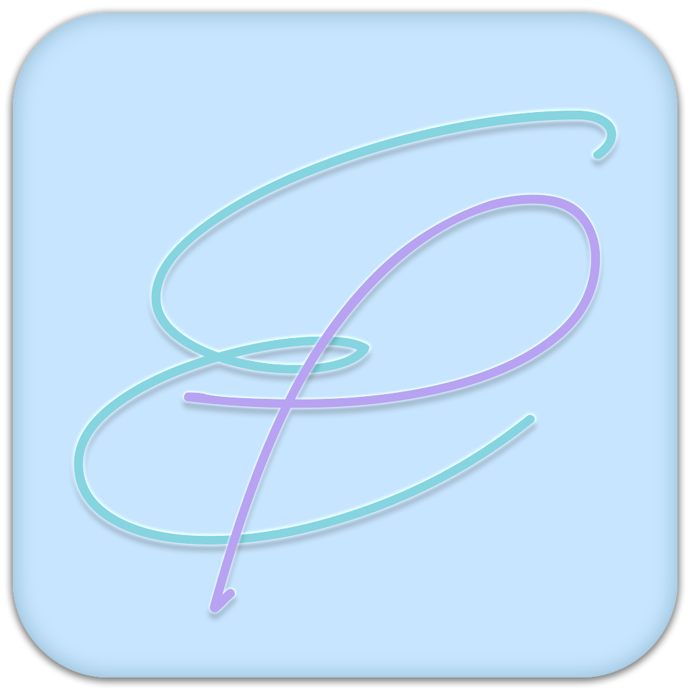

# EasyPaste - 高效剪贴板管理工具



> ⚠️ 项目状态：
> 
> **当前版本**: v0.1.1 (开发测试阶段)
> 
> 1. **测试环境**: 已在 Windows 10/11 纯净版系统测试，核心功能稳定
> 2. **质量保证**: 采用严格的代码规范和安全策略，持续改进中
> 3. **系统集成**: 如需完全替换 Windows 剪贴板，请参考 [FAQ 文档](./FAQ/replace_global_hotkey_theory/replace_global_hotkey_theory.md)
> 4. **注意**:  由于是个人项目，可能部分边缘性测试场景没有覆盖到，欢迎提issue和PR


## 项目简介

EasyPaste 是一个专注于提升工作效率的跨平台剪贴板管理工具，基于 Tauri + Vue3 + TypeScript 技术栈开发。通过智能化的剪贴板历史记录管理，为开发者、设计师、办公人员等用户提供简洁高效的复制粘贴体验，显著提升日常工作效率。

### ✨ 核心特性

- 🚀 **高性能**: 基于 Rust + Tauri 构建，启动时间 < 2秒，内存占用 < 50MB
- 🔒 **隐私安全**: 所有数据本地存储，不上传云端
- 📄 **文件安全**: 不实际操作任何文件，只保存文件路径，保证文件原始性
- 🎨 **现代化界面**: 基于 Vue3 + Naive UI，支持多主题，响应式设计
- 🌍 **跨平台支持**: 支持 Windows 10/11，macOS 10.13+
- 📦 **轻量级**: 安装包小巧，启动迅速，后台 CPU 占用 < 1%

## 主要功能

### 📋 剪贴板管理
- **自动监控剪贴板**: 实时捕获并保存剪贴板中的文本和文件内容
- **智能去重**: 自动识别重复内容，更新时间戳而非创建新记录
- **历史记录管理**: 按时间顺序保存剪贴板历史，支持置顶重要内容
- **分页加载**: 支持大量历史记录的高效分页显示，默认保存 2000 条
- **多类型支持**: 完整支持文本、文件的复制粘贴操作

### 🏷️ 标签与分类
- **自定义标签**: 为剪贴板内容添加自定义标签，便于分类管理
- **颜色标识**: 支持为标签设置不同颜色，视觉化分类
- **标签筛选**: 按标签快速筛选和查找相关内容
- **批量管理**: 支持批量添加、删除、修改标签
- **智能建议**: 基于内容自动建议相关标签（规划中）

### 🔍 搜索与导航
- **实时搜索**: 支持内容关键词搜索，响应时间 < 100ms
- **模糊匹配**: 支持部分关键词匹配，智能搜索算法
- **多维筛选**: 支持内容、标签组合筛选（已发布），按照类型、时间范围的组合筛选（规划中）
- **快捷导航**: 键盘快捷键支持，提升操作效率

### ⚙️ 系统集成
- **系统托盘**: 支持系统托盘操作，随时快速访问
- **全局快捷键**: 支持自定义全局快捷键（默认 Alt+C），快速调用
- **智能窗口**: 失焦自动隐藏，alwaysOnTop 模式，不干扰工作
- **开机自启**: 可设置开机自启动，后台静默运行
- **系统通知**: 重要操作系统通知提醒

### 🎨 个性化定制
- **多主题支持**: 内置浅色、深色、蓝色、粉色等多种主题
- **多语言支持**: 中文、英文等多语言界面，本地化适配
- **界面定制**: 支持 FiraCode 等宽字体，颜色个性化设置
- **窗口尺寸**: 支持窗口大小调整（350x550 - 800x1000）

### 🔄 数据管理
- **自动更新**: 内置应用自动更新功能，签名验证确保安全
- **智能清理**: 支持按时间和数量自动清理历史数据
- **数据备份**: 支持数据的备份和恢复（规划中）
- **SQLite 存储**: 使用 SQLite 数据库，数据安全可靠，支持加密
- **数据迁移**: 支持版本升级时的数据平滑迁移

## 技术架构

### 前端技术栈
- **Vue 3.5+**: 使用组合式 API 构建用户界面
- **TypeScript 5.6+**: 提供类型安全的代码编写体验，严格模式
- **Naive UI 2.41+**: 美观现代的 UI 组件库
- **Vue Router 4**: 页面路由管理
- **Pinia 3.0+**: 状态管理库
- **Vite 6.0+**: 现代前端构建工具，支持 HMR

### 后端技术栈
- **Tauri 2.x**: 使用 Rust 构建的跨平台应用框架
- **SQLite**: 本地数据存储，支持 SQL 查询和事务
- **Rust**: 高性能、内存安全的系统编程语言
- **clipboard-rs**: 跨平台剪贴板操作库

## 主要依赖

### 前端依赖

- `@tauri-apps/api`：Tauri API 客户端
- `vue`：Vue 3 核心库
- `vue-router`：Vue 路由管理
- `pinia`：Vue 状态管理
- `naive-ui`：UI 组件库
- `vfonts`：字体支持
- `@highlightjs/vue-plugin`：代码高亮支持
- `highlight.js`：语法高亮库

### 核心 Tauri 插件
- `tauri-plugin-autostart`：自启动支持
- `tauri-plugin-sql`: SQLite 数据库支持
- `tauri-plugin-global-shortcut`: 全局快捷键支持
- `tauri-plugin-autostart`: 开机自启动
- `tauri-plugin-notification`: 系统通知
- `tauri-plugin-updater`: 应用自动更新
- `tauri-plugin-store`: 配置数据存储
- `tauri-plugin-opener`：文件打开
- `tauri-plugin-process`：进程管理
- `tauri-plugin-shell`：Shell 命令执行
- `tauri-plugin-log`: 日志管理


### Rust 依赖

- `clipboard-rs`：跨平台剪贴板操作
- `serde` & `serde_json`：JSON 序列化/反序列化
- `chrono`：日期时间处理
- `dirs`：系统目录获取
- `log`：日志记录
- `lazy_static`：静态变量管理

## 快速开始

### 📥 安装使用

1. 从 [Releases](https://github.com/lin0306/EasyPaste/releases) 页面下载最新版本
2. 运行安装程序完成安装
3. 启动应用，首次运行会自动初始化数据库
4. 开始使用剪贴板管理功能

### ⌨️ 快捷键

- `Alt + C`：显示/隐藏主窗口（可自定义）
- `Ctrl + F`：激活搜索框（应用内）
- `Esc`：隐藏搜索框
- `单击托盘图标`：显示/隐藏主窗口

## 开发环境设置

### 前提条件

- **Node.js** (推荐 v18+)
- **Rust** (最新稳定版)
- **pnpm** 包管理器

### 克隆项目

```bash
git clone https://github.com/lin0306/EasyPaste.git
cd EasyPaste
```

### 安装依赖

```bash
pnpm install
```

### 开发模式运行

```bash
pnpm tauri dev
```

### 构建生产版本

```bash
pnpm tauri build
```

### 项目结构

```
EasyPaste/
├── src/                    # 前端源码
│   ├── components/         # Vue 组件
│   ├── views/              # 页面视图
│   ├── services/           # 业务服务层
│   ├── configs/            # 配置管理
│   ├── store/              # Pinia 状态管理
│   ├── types/              # TypeScript 类型定义
│   ├── utils/              # 工具函数
│   ├── data/               # 静态数据和多语言
│   └── assets/             # 静态资源
├── src-tauri/              # Tauri 后端
│   ├── src/                # Rust 源码
│   ├── icons/              # 应用图标
│   ├── capabilities/       # Tauri 权限配置
│   ├── windows/            # NSIS 配置
│   └── Cargo.toml          # Rust 依赖配置
├── public/                 # 静态资源
├── FAQ/                    # 常见问题文档
├── .github/                # Github 配置
└── dist/                   # 构建输出
```

## 🤝 贡献指南

我们欢迎所有形式的贡献！

### 如何贡献

1. **Fork** 本仓库
2. 创建您的特性分支 (`git checkout -b feature/AmazingFeature`)
3. 提交您的更改 (`git commit -m 'Add some AmazingFeature'`)
4. 推送到分支 (`git push origin feature/AmazingFeature`)
5. 打开一个 **Pull Request**

### 报告问题

如果您发现了 bug 或有功能建议，请：

1. 查看 [Issues](https://github.com/lin0306/EasyPaste/issues) 确认问题未被报告
2. 创建新的 Issue，详细描述问题或建议
3. 提供复现步骤（如果是 bug）

### 开发规范

- 遵循现有的代码风格
- 为新功能添加适当的注释
- 确保代码通过所有测试
- 更新相关文档

## 📄 许可证

本项目基于 [Apache License 2.0](LICENSE) 许可证开源。

## 💡 常见问题

### 使用问题
- [Windows 剪贴板替换系统剪贴板原理](./FAQ/replace_global_hotkey_theory/replace_global_hotkey_theory.md)
- [Windows 如何以管理员身份运行](./FAQ/rights_of_administrators/rights_of_administrators.md)

## 🙏 致谢

感谢以下开源项目：

- [Tauri](https://tauri.app/) - 跨平台应用框架
- [Vue.js](https://vuejs.org/) - 渐进式 JavaScript 框架
- [Naive UI](https://www.naiveui.com/) - Vue 3 组件库
- [clipboard-rs](https://github.com/ChurchTao/clipboard-rs) - Rust 剪贴板库

## 📞 联系方式

- 项目主页：[GitHub Repository](https://github.com/lin0306/EasyPaste)
- 问题反馈：[Issues](https://github.com/lin0306/EasyPaste/issues)

---

如果这个项目对您有帮助，请考虑给它一个 ⭐️！
