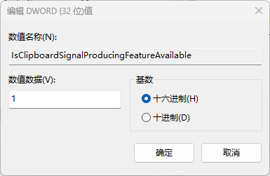

## Windows 替换系统剪贴板快捷键原理
#### 1.打开注册表编辑器
#### 2找到`\HKEY_LOCAL_MACHINE\SOFTWARE\Microsoft\Clipboard`配置

#### 3.删除`Clipboard`文件夹或者重命名（截图为重命名处理）
#### 4.重启电脑
> 这个配置应该是设置系统剪贴板功能是否可用的配置，移除这个配置后，系统剪贴板程序不会自动启动，所以通过快捷键也无法打开程序，也无法设置
## Windows 系统剪贴板如何恢复
### 直接删除的情况
#### 1.在`\HKEY_LOCAL_MACHINE\SOFTWARE\Microsoft`目录下新建文件夹

#### 2.文件夹名为`Clipboard`
#### 3.在右侧新建类型为`DWORD（32位）值`的数据
#### 具体内容如下：
```asm
数值名称：IsClipboardSignalProducingFeatureAvailable
值：1
类型：DWORD
```


```asm
数值名称：IsCloudAndHistoryFeatureAvailable
值：1
类型：DWORD
```

### 文件夹重命名的情况
#### 把`\HKEY_LOCAL_MACHINE\SOFTWARE\Microsoft\`目录下重命名后的文件改回`Clipboard`即可